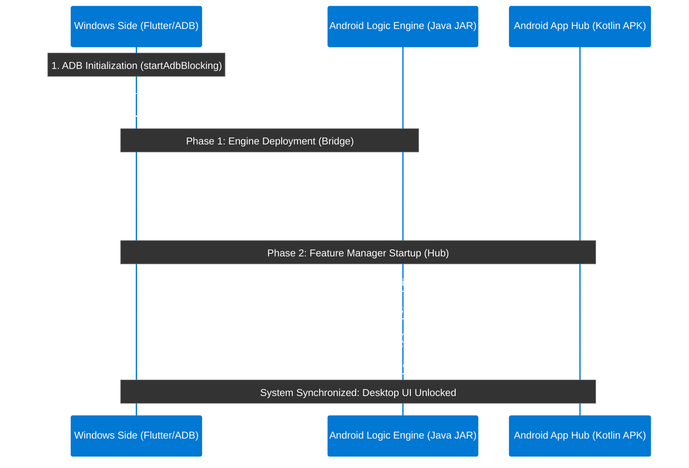

<div align="center">

# 📱 Android DEX

### *Your Phone, Reimagined as a Desktop*

[](https://microsoft.com/windows)
[](https://kernel.org)
[](https://flutter.dev)
[](https://developer.android.com)
[](LICENSE)


</div>


## 🚀 Quick Start

### Connect Your Device

| Mode | Setup |
| :--- | :--- |
| **USB** | Plug in your phone · Enable **USB Debugging** |
| **Wi-Fi** | Same network · Enable **Wireless Debugging** |

### Launch Options

#### 🪟 Windows

**Auto-detect (Recommended)**
```bash
android_dex_win.exe
```

**Force USB Connection**
```bash
android_dex_win.exe --usb
```

**Connect via IP Address**
```bash
android_dex_win.exe 192.168.1.100
```

**Connect via IP & Port**
```bash
android_dex_win.exe 192.168.1.100:5555
```

#### 🐧 Linux

1. **Prepare**: Extract `android_dex_linux.tar.gz` and open terminal in the folder.
2. **Setup**: Make the script executable:
   ```bash
   chmod +x run_android_dex.sh
   ```
3. **Launch**:
   ```bash
   ./run_android_dex.sh
   ```

> **Note:** The `run_android_dex.sh` script automatically checks if your Linux environment is compatible (drivers, graphics, and dependencies) and ready to launch the session.

---

## 📖 Deep-Dive Documentation

Check out these detailed guides to understand exactly how Android DEX works under the hood:

1. **[Architectural Design](doc/ARCHITECTURE.md)** — Three-layer system design, responsibilities, and data flow.
2. **[Boot & Initialization](doc/BOOT_FLOW.md)** — Step-by-step connection flow with progress stages.
3. **[Reconnection System](doc/RECONNECTION.md)** — Smart auto-healing, recovery phases, and UI overlay.
4. **[Real-Time Data Model](doc/DATA_MODEL.md)** — State store, JSON telemetry protocols, and message handling.
5. **[Error Handling](doc/ERROR_HANDLING.md)** — User-facing messaging pipelines and full fallback reference.
6. **[System Modules](doc/MODULES.md)** — Internal component roles, public APIs, and singletons.
7. **[Device Manager](doc/DEVICE_MANAGER.md)** — ADB device selection, UI dialogs, and IP connections.

---


## 🛠️ How It Works — The Handshake Protocol

The system uses a three-layer architecture with a cryptographic-style handshake before the desktop UI unlocks. Every component must confirm readiness before the session begins.



---

## 📱 App Preview

<div align="center">

**Desktop Home Interface**


---

|  |  |
|:---:|:---:|
| **App Dashboard** | **Multi-App View** |

|  |  |
|:---:|:---:|
| **Media Center** | **Android Control** |

|  |  |
|:---:|:---:|
| **Audio Overlay** | **Media Preferences** |

</div>

---

## 🏗️ Three-Layer Architecture

Android DEX distributes responsibilities across three specialized layers:

| Layer | Role | Technology |
| :--- | :--- | :--- |
| **Windows Side** | Orchestration, UI, Streaming | Flutter · ADB · Native C++ · scrcpy |
| **Logic Engine** | Low-level device commands | Java · ADB Shell |
| **Feature Hub** | Telemetry, Notifications, Media | Kotlin · Android SDK |

→ **[Deep-dive: Architecture »](doc/ARCHITECTURE.md)**


---

## 📋 Getting Started

### Prerequisites

- **OS**: Windows 10+ or Modern Linux (Ubuntu, Fedora, etc.)
- **Device**: Android device running Android 8.0+
- **Drivers**: ADB is bundled — no separate installation needed

### Step-by-Step

1. **Enable Developer Options** on your phone
   - `Settings → About Phone` → tap **Build Number** 7 times

2. **Enable USB Debugging**
   - `Settings → Developer Options → USB Debugging → ON`

3. **Plug in your phone** (for USB) or **enable Wireless Debugging** (for Wi-Fi)

4. **Launch Android DEX** — watch the boot progress bars fill to 100%

5. **The desktop unlocks** — your Android is now a full Windows desktop experience

> If connection fails, a **"Select Device"** button appears in the boot screen — click it to open the ADB Manager and pick your device without restarting.

---

<div align="center">

*Engineered for performance. Optimized for productivity.*

Built by [@shrey113](https://github.com/shrey113)

</div>
