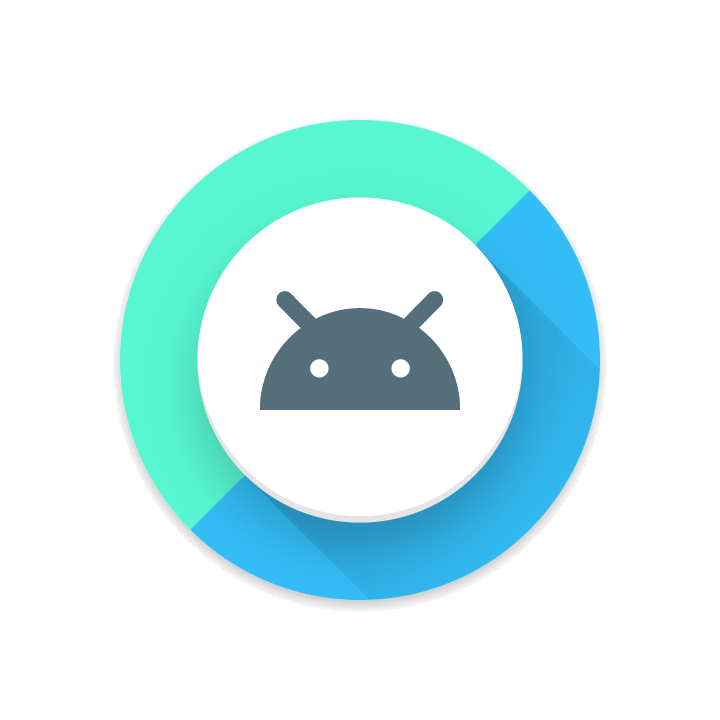
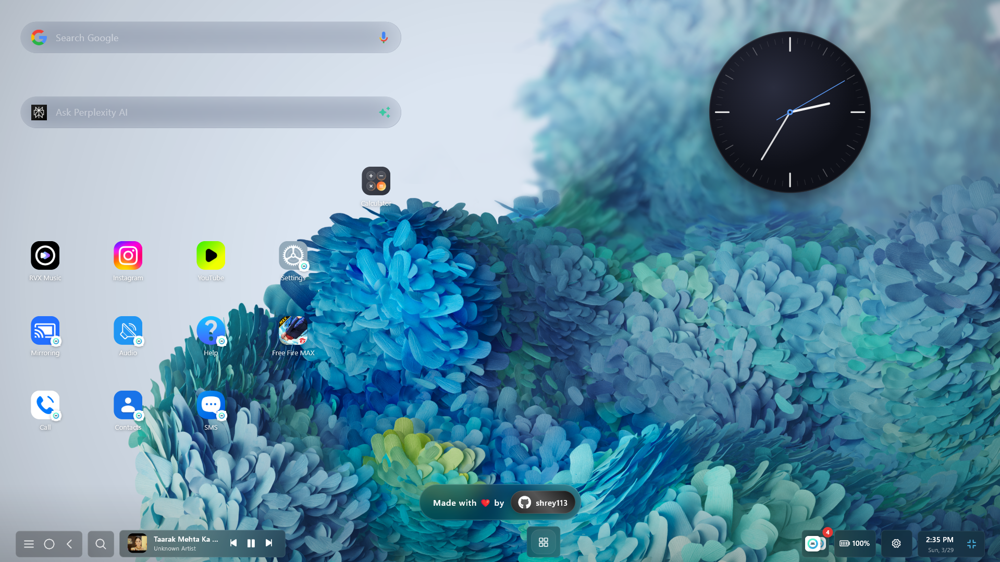
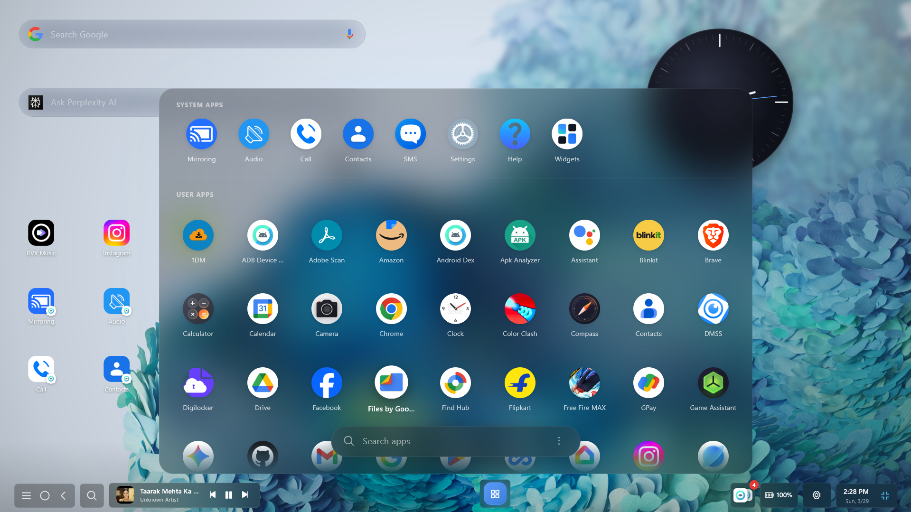
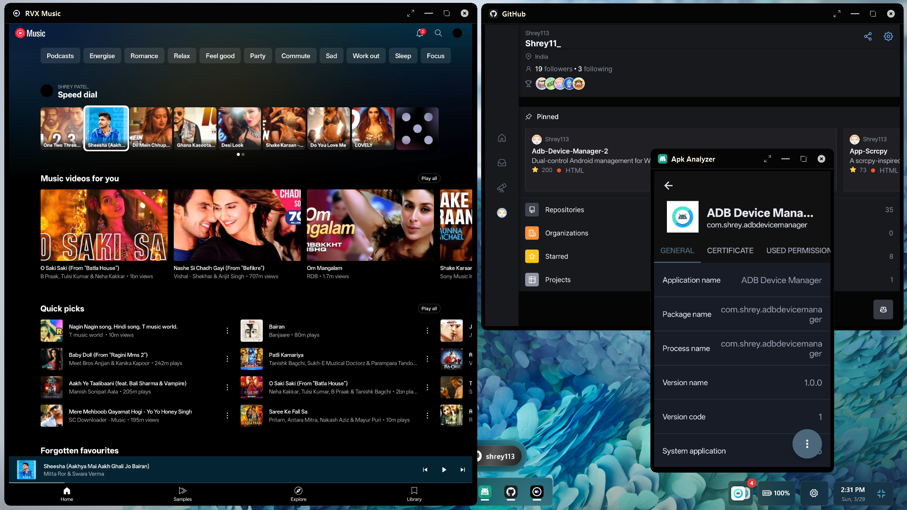
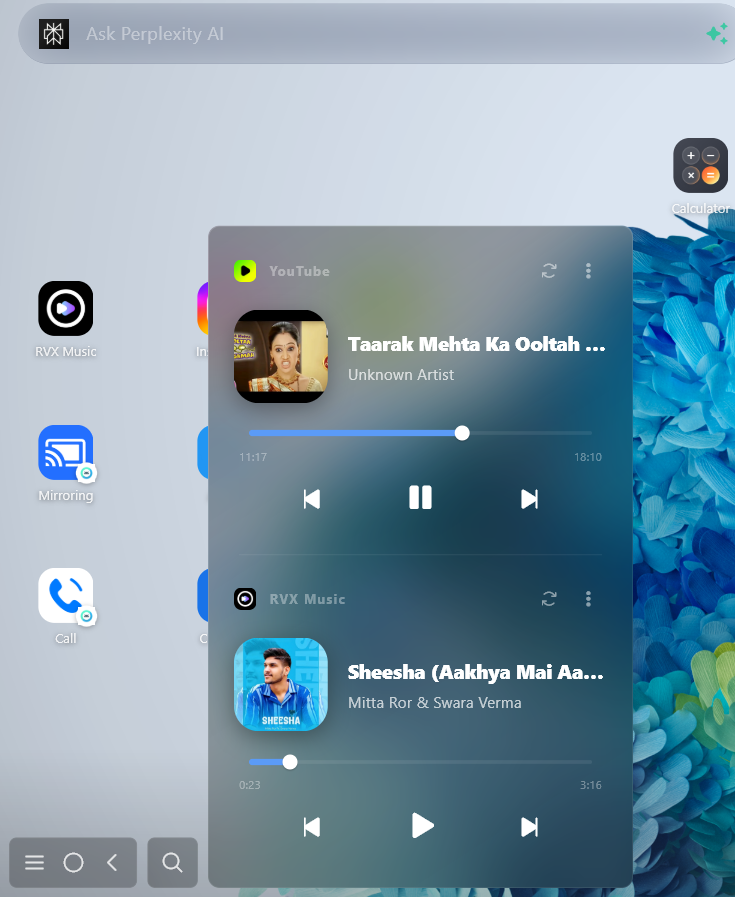
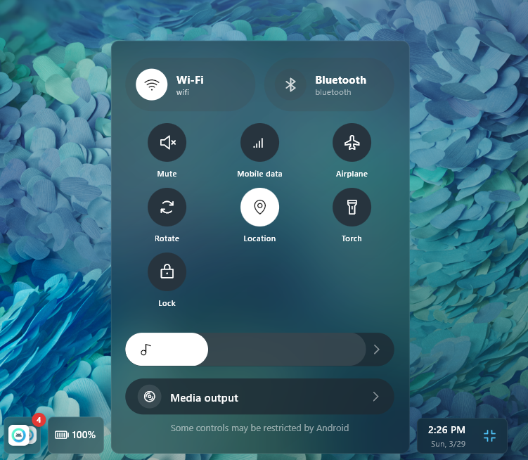
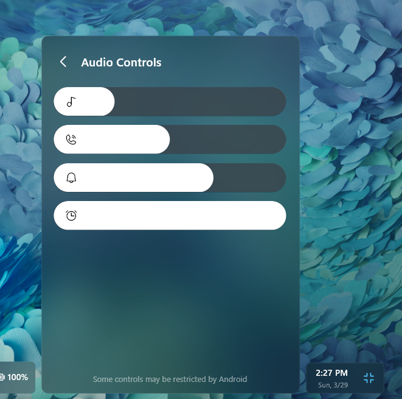
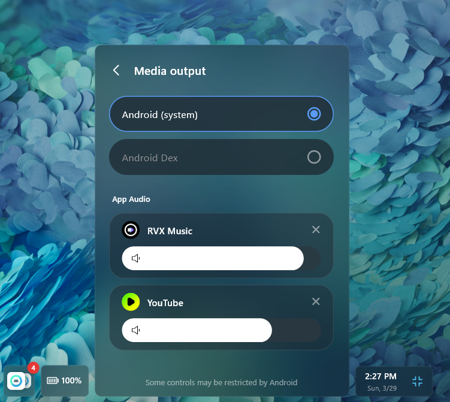

# Android DEX

**Transform your Android device into a complete desktop experience.**

Android DEX is a free desktop application for **Windows, Linux, and macOS** that lets you run Android apps in resizable desktop-style windows, mirror screens, stream per-app audio, manage notifications, control media playback, and game with native keyboard and mouse input — all using high-performance ADB and companion services over USB or Wi-Fi.

 

  
  
  
  
  
  

  
  
  
  

---

### Download Android DEX

| Platform | Download |
| :--- | :--- |
| Windows | [Download](https://github.com/Shrey113/Android-Dex/releases/latest/download/Android_Dex_Windows.zip) |
| Linux | [Download](https://github.com/Shrey113/Android-Dex/releases/latest/download/Android_Dex_Linux.AppImage) |
| macOS | [Download](https://github.com/Shrey113/Android-Dex/releases/latest/download/Android_Dex_macOS.zip) |

---

## App Preview

**Desktop Home Interface**

 

|  |  |
|:---:|:---:|
| **App Dashboard** | **Multi-App View** |

|  |  |
|:---:|:---:|
| **Media Center** | **Android Control** |

|  |  |
|:---:|:---:|
| **Audio Overlay** | **Media Preferences** |

---

### Keyboard Shortcuts

Boost your productivity with built-in keyboard shortcuts for the most common actions:

| Shortcut | Action |
| :---: | :--- |
| `Ctrl + G` | Toggle Game Controls / Gaming Mode for current app |
| `Ctrl + F` | Enter / Toggle Fullscreen |
| `Esc` | Exit Fullscreen |
| `Ctrl + Alt + Up` / `Down` | System-level hotkey to Show / Hide Android DEX |
| `Ctrl + Alt + Left` / `Right` | Switch active device / Open device switcher panel |

---

### Gaming Mode (No Emulator Detection)

Experience true desktop-grade gaming with zero emulator detection. Because games execute directly on your physical Android hardware and touch events are passed via low-level native protocols, anti-cheat systems recognize your device as a genuine mobile phone—giving you full access to native mobile lobbies without emulator bans or restrictions.

| Control / Button | Description |
| :--- | :--- |
| **Tap Spot Button** | Single tap or turbo rapid-fire mapped to any keyboard key or mouse click at exact screen coordinates |
| **D-Pad / Joystick** | 8-directional movement (WASD) with adjustable radius, deadzone, sprint zone, and analog smoothing |
| **FPS Mouse Lock & Gyro Aim** | True 360° FPS camera control with cursor locking and gyroscope sensor emulation for precision aiming |
| **Right-Click Aim / ADS** | Dedicated Right-Click trigger for instant Scope / Aim-Down-Sights (ADS) or secondary action toggle |
| **Swipe & Skill Trigger** | Directional swipe gestures, skill casting, and flick mechanics bound to single key presses |
| **Script & Combo Macro** | Multi-step automated touch sequences (tap combos, delays, and directional swipes) mapped to a single key |
| **Game Profile Manager** | Create, save, and auto-load customized control layouts per game with local database storage |

---

### Technologies & Open-Source Dependencies

Android DEX is built on top of industry-standard open-source libraries and native platform frameworks:

* **[ADB — Android Debug Bridge](https://developer.android.com/tools/releases/platform-tools)** – Core protocol for device communication, wireless pairing, and ADB command execution.
* **[scrcpy](https://github.com/Genymobile/scrcpy)** – High-performance, low-latency screen mirroring and remote input control for Android devices.
* **[Flutter](https://flutter.dev/)** – Cross-platform UI framework used to build the desktop client.
* **[Kotlin](https://kotlinlang.org/)** – Powers the companion Android service, media listener, and settings UI.

> Special thanks to **[rom1v](https://github.com/rom1v)** for their foundational contributions to the open-source ADB and scrcpy ecosystems, which provided critical architectural insights for this project.

---

### Official Documentation & Resources

| Category | Resource |
| :--- | :--- |
| Architectural Design | [Read the Architecture Specs](doc/ARCHITECTURE.md) |
| Boot & Handshake Flow | [View Boot & Initialization Flow](doc/BOOT_FLOW.md) |
| Reconnection System | [View Reconnection & Auto-Healing Guide](doc/RECONNECTION.md) |
| Real-Time Data Model | [Read the Data Model & Telemetry Specs](doc/DATA_MODEL.md) |
| Error & Fallback Handling | [View Error Handling & Diagnostic Reference](doc/ERROR_HANDLING.md) |
| System Modules | [View System Module Directory](doc/MODULES.md) |
| Device Manager | [View Device Manager Reference](doc/DEVICE_MANAGER.md) |

---

### Thanks for using Android DEX! 🎉

**Made by [Shrey113](https://github.com/Shrey113)**

