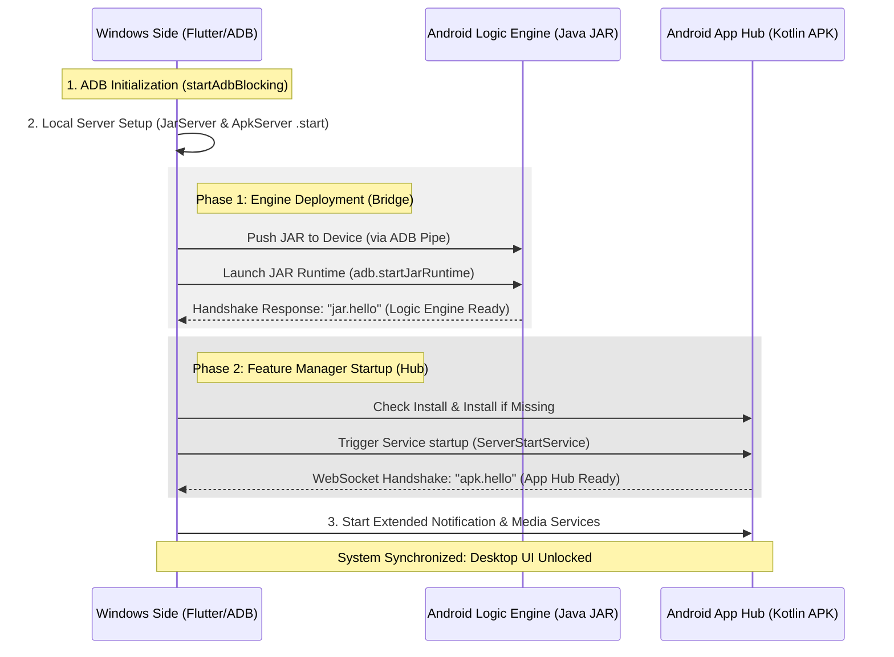

<div align="center">

# 📱 Android DEX

### *Your Phone, Reimagined as a Desktop*

[](https://microsoft.com/windows)
[](https://flutter.dev)
[](https://developer.android.com)
[](LICENSE)

> A high-performance Windows desktop application that transforms any Android device into a full-featured desktop environment — multi-window multitasking, live system telemetry, app streaming, and hardware integration — all without root access.

</div>

---

## 📖 Deep-Dive Documentation

Check out these detailed guides to understand exactly how Android DEX works under the hood:

1. **[Architectural Design](doc/ARCHITECTURE.md)** — Three-layer system design, responsibilities, and data flow.
2. **[Boot & Initialization](doc/BOOT_FLOW.md)** — Step-by-step connection flow with progress stages.
3. **[Reconnection System](doc/RECONNECTION.md)** — Smart auto-healing, recovery phases, and UI overlay.
4. **[Real-Time Data Model](doc/DATA_MODEL.md)** — State store, JSON telemetry protocols, and message handling.
5. **[Error Handling](doc/ERROR_HANDLING.md)** — User-facing messaging pipelines and full fallback reference.
6. **[System Modules](doc/MODULES.md)** — Internal component roles, public APIs, and singletons.
7. **[Device Manager](doc/DEVICE_MANAGER.md)** — ADB device selection, UI dialogs, and IP connections.

---

## ✨ Key Features

| Feature | Description |
|---|---|
| **Multi-Window Apps** | Each Android app runs in its own resizable, movable Windows window |
| **Live System Telemetry** | Real-time Battery, Volume, Wi-Fi, Bluetooth, Mobile Data & more |
| **Notification Streaming** | Android notifications pushed instantly to your Windows desktop |
| **Media Control** | Artwork, metadata & playback controls from the Windows side |
| **Near-Zero Latency Commands** | Shell-level command execution bypasses Android UI overhead entirely |
| **Auto-Reconnection** | Multi-stage smart recovery — restores connection without app restarts |
| **No Root Required** | All features operate through standard ADB and Android permissions |
| **USB & Wi-Fi** | Works seamlessly over both cable and wireless connections |

---

## 🚀 Quick Start

### Connect Your Device

| Mode | Setup |
| :--- | :--- |
| **USB** | Plug in your phone · Enable **USB Debugging** |
| **Wi-Fi** | Same network · Enable **Wireless Debugging** |

### Launch Options

```bash
# Auto-detect — recommended for first use
android_dex_win.exe

# Force USB connection
android_dex_win.exe --usb

# Connect to a specific IP address
android_dex_win.exe 192.168.1.100

# Connect with explicit port
android_dex_win.exe 192.168.1.100:5555
```

> **Smart Auto-Detection:** With no arguments, the app scans for available devices. One device found → connects automatically. Zero or multiple → the **ADB Manager** dialog opens to let you choose — no restart needed.

---

## 🛠️ How It Works — The Handshake Protocol

The system uses a three-layer architecture with a cryptographic-style handshake before the desktop UI unlocks. Every component must confirm readiness before the session begins.



---

## 🏗️ Three-Layer Architecture

Android DEX distributes responsibilities across three specialized layers:

| Layer | Role | Technology |
| :--- | :--- | :--- |
| **Windows Side** | Orchestration, UI, Streaming | Flutter · ADB · Native C++ · scrcpy |
| **Logic Engine** | Low-level device commands | Java · ADB Shell |
| **Feature Hub** | Telemetry, Notifications, Media | Kotlin · Android SDK |

→ **[Deep-dive: Architecture »](doc/ARCHITECTURE.md)**


---

## 📋 Getting Started

### Prerequisites

- Windows 10 or later
- Android device running Android 8.0+
- ADB is bundled — no separate installation needed

### Step-by-Step

1. **Enable Developer Options** on your phone
   - `Settings → About Phone` → tap **Build Number** 7 times

2. **Enable USB Debugging**
   - `Settings → Developer Options → USB Debugging → ON`

3. **Plug in your phone** (for USB) or **enable Wireless Debugging** (for Wi-Fi)

4. **Launch Android DEX** — watch the boot progress bars fill to 100%

5. **The desktop unlocks** — your Android is now a full Windows desktop experience

> If connection fails, a **"Select Device"** button appears in the boot screen — click it to open the ADB Manager and pick your device without restarting.

---

## 🤝 If Connection Fails

- The boot screen shows a clear, plain-English error message
- A **"Open ADB Manager — Select Device"** button appears automatically
- Click it → pick your device or type an IP address → the system retries on its own

---

<div align="center">

*Engineered for performance. Optimized for productivity.*

Built by [@shrey113](https://github.com/shrey113)

</div>
