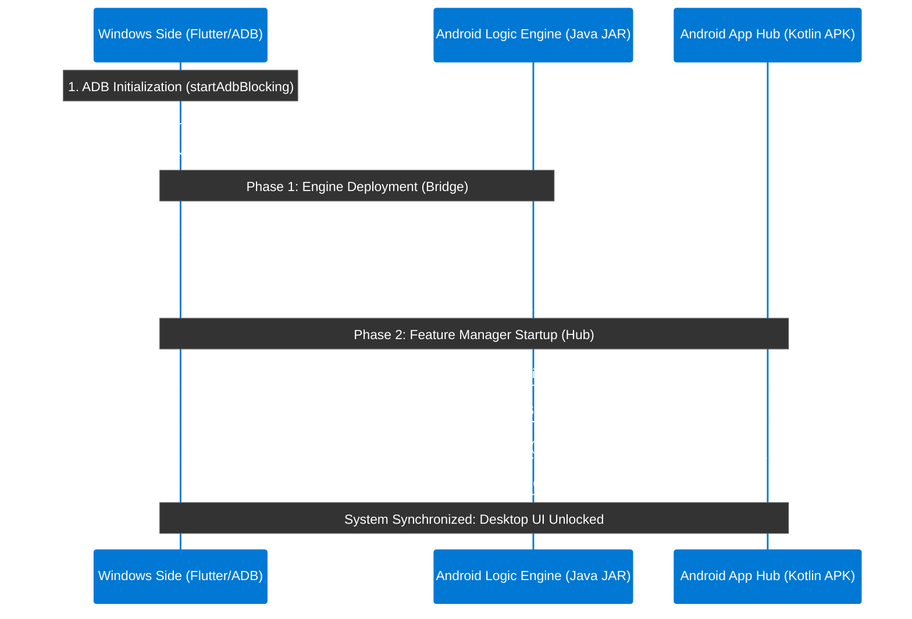

# Android DEX

**Transform your Android device into a desktop experience.**
Mirror apps, control your phone, stream audio, manage media, launch multiple Android apps, and connect over USB or Wi-Fi — all from Windows or Linux.

---

### 🚀 Quick  Download

| Platform | Download Link |
| :--- | :--- |
| **ADB Device Manager** | [Main System Project](https://github.com/Shrey113/Adb-Device-Manager-2) |
| **Windows** | [android_dex_win.zip](https://github.com/Shrey113/Android-Dex/releases/latest/download/Android_Dex_Windows.zip) |
| **Linux** | ⌛ under development |

---

## 📱 App Preview

**Desktop Home Interface**

---

|  |  |
|:---:|:---:|
| **App Dashboard** | **Multi-App View** |

|  |  |
|:---:|:---:|
| **Media Center** | **Android Control** |

|  |  |
|:---:|:---:|
| **Audio Overlay** | **Media Preferences** |

---

## 📖 Deep-Dive Documentation

Check out these detailed guides to understand exactly how Android DEX works under the hood:

1. **[Architectural Design](doc/ARCHITECTURE.md)** : Three-layer system design, responsibilities, and data flow.
2. **[Boot & Initialization](doc/BOOT_FLOW.md)** : Step-by-step connection flow with progress stages.
3. **[Reconnection System](doc/RECONNECTION.md)** : Smart auto-healing, recovery phases, and UI overlay.
4. **[Real-Time Data Model](doc/DATA_MODEL.md)** : State store, JSON telemetry protocols, and message handling.
5. **[Error Handling](doc/ERROR_HANDLING.md)** : User-facing messaging pipelines and full fallback reference.
6. **[System Modules](doc/MODULES.md)** : Internal component roles, public APIs, and singletons.
7. **[Device Manager](doc/DEVICE_MANAGER.md)** : ADB device selection, UI dialogs, and IP connections.

---

## 🚀 Launch Options

### 🪟 Windows

| Command | Description |
| :--- | :--- |
| `android_dex_win.exe` | **Auto-detect** — recommended for most users |
| `android_dex_win.exe --usb` | Force **USB** connection only |
| `android_dex_win.exe 192.168.1.100` | Connect via **IP address** |
| `android_dex_win.exe 192.168.1.100:5555` | Connect via **IP & custom port** |

### 🐧 Linux

| Step | Command | Description |
| :---: | :--- | :--- |
| 1 | `cd android_dex_linux/` | Enter the extracted folder |
| 2 | `chmod +x run_android_dex.sh` | Make the script executable |
| 3 | `./run_android_dex.sh` | Launch Android DEX |

> The script auto-checks Linux compatibility — drivers, graphics, and dependencies — before starting.

---

## 🛠️ How It Works — The Handshake Protocol

The system uses a three-layer architecture with a cryptographic-style handshake before the desktop UI unlocks. Every component must confirm readiness before the session begins.

---

## 📋 Getting Started

### Prerequisites

- **OS**: Windows 10+ or Modern Linux (Ubuntu, Fedora, etc.)
- **Device**: Android device running Android 8.0+
- **Drivers**: ADB is bundled — no separate installation needed

### Step-by-Step

1. **Enable Developer Options** on your phone
   - `Settings → About Phone` → tap **Build Number** 7 times

2. **Enable USB Debugging**
   - `Settings → Developer Options → USB Debugging → ON`

3. **Plug in your phone** (for USB) or **enable Wireless Debugging** (for Wi-Fi)

4. **Launch Android DEX** — watch the boot progress bars fill to 100%

5. **The desktop unlocks** — your Android is now a full Windows desktop experience

> If connection fails, a **"Select Device"** button appears in the boot screen — click it to open the ADB Manager and pick your device without restarting.

---

*Engineered for performance. Optimized for productivity.*

Built by [@shrey113](https://github.com/shrey113)

